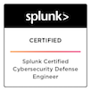
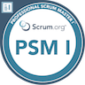

# **Bill Reimer**
**Cyber Warfare Engineer** | **Chesapeake, VA**

## **Summary**
*A concise and compelling summary of your skills, experience, and career goals.*

## **Skills**
* **Technical Skills:**
  * Programming languages (e.g., Python, Java, C++)
  * Data analysis tools (e.g., SQL, Pandas, NumPy)
  * Cloud platforms (e.g., AWS, GCP, Azure)
  * Other technical skills (e.g., machine learning, data science)
* **Soft Skills:**
  * Problem-solving
  * Communication
  * Teamwork
  * Leadership

## **Experience**
### **Cyber Warfare Engineer**
**US Navy** | **Various** | **2012-Present**
* **Key responsibilities and achievements:**
  * Bullet point 1
  * Bullet point 2
  * Bullet point 3

### **Job Title**
**Company Name** | **Location** | **Dates**
* **Key responsibilities and achievements:**
  * Bullet point 1
  * Bullet point 2
  * Bullet point 3

## **Education**

### **M.S. Information Technology**
**University of Maryland Global Campus** | **MD** | **2020**
* **Relevant coursework and projects:**
  * Bullet point 1
  * Bullet point 2
  * Bullet point 3

### **B.S. Computer Science**
**University of Illinois at Urbana-Champaign** | **Urbana, IL** | **2012**
* **Relevant coursework and projects:**
  * Bullet point 1
  * Bullet point 2
  * Bullet point 3

## **Projects**
### **SIEM Standup**
* **Brief description of the project**
  * **Technologies used:**
    * Technology 1
    * Technology 2
    * Technology 3
  * **Link to project repository (if applicable)**

## **Certifications**

https://www.credly.com/users/bill-reimer.cc9aa081

* **Splunk Certified Cybersecurity Defense Engineer**
  * Splunk
  * 2024

* **Professional Scrum Master**
  * Scrum.org
  * 2024

  

## **Awards and Honors**
* **Award Name**
  * Awarding Organization
  * Year

## **Contact Information**
* **Email:** bill@reimerfamily.net
* **GitHub:** https://github.com/Hack3rDan

**Tips for Creating a Strong Markdown Resume:**

1. **Keep it simple and clean:** Use clear headings and bullet points.
2. **Tailor your resume to specific job applications:** Highlight relevant skills and experiences.
3. **Use strong action verbs:** Start each bullet point with a powerful verb (e.g., "Developed," "Implemented," "Led").
4. **Quantify your achievements:** Use metrics to showcase your impact (e.g., "Increased sales by 20%").
5. **Proofread carefully:** Check for typos, grammatical errors, and formatting inconsistencies.
6. **Consider using a Markdown previewer:** This will help you visualize how your resume will look when rendered.

By following these guidelines, you can create a professional and effective Markdown resume that will help you stand out from the crowd.
